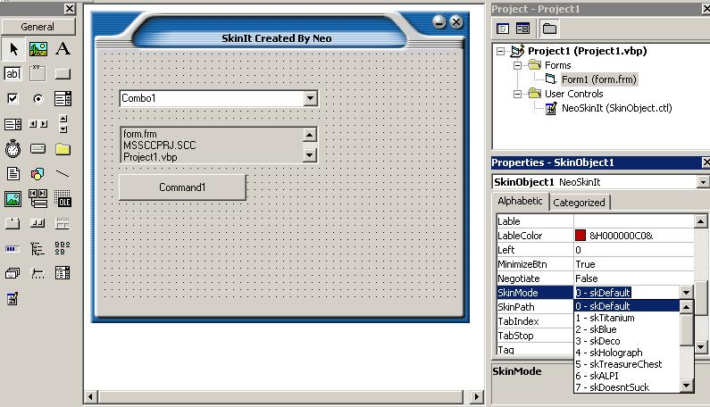



## SkinIt \(A design time VB Form Skinner\)

### Description

Hi This is My Third Submission named as SkinIt. Its a user control (Source Include) to skin your VB Froms at design time as well as run time. I got the inspiration from our own PSC, but all of the code i found only skins the form at runtime or one have to use some heavy skinning engine. But this ctrl is very light in weight and supports 15 customizable skins. But Before all i want to thanx all the developers who helped me to do such thing... Please See the screenshot and as usual DO NOT FORGOT TO VOTE... (some day my code will become the "Code of the Month") ;-) ...
 
### More Info
 

             |
---                |---
**Submitted On**   |2003-07-31 14:15:30
**By**             |[TheIndoctrinator \!\!](https://github.com/Planet-Source-Code/PSCIndex/blob/master/ByAuthor/theindoctrinator.md)
**Level**          |Intermediate
**User Rating**    |4.8 (111 globes from 23 users)
**Compatibility**  |VB 3\.0, VB 4\.0 \(16\-bit\), VB 4\.0 \(32\-bit\), VB 5\.0, VB 6\.0, VB Script, ASP \(Active Server Pages\) , VBA MS Access, VBA MS Excel
**Category**       |[Custom Controls/ Forms/  Menus](https://github.com/Planet-Source-Code/PSCIndex/blob/master/ByCategory/custom-controls-forms-menus__1-4.md)
**World**          |[Visual Basic](https://github.com/Planet-Source-Code/PSCIndex/blob/master/ByWorld/visual-basic.md)
**Archive File**   |[SkinIt\_\(A\_1892105252005\.zip](https://github.com/Planet-Source-Code/theindoctrinator-skinit-a-design-time-vb-form-skinner__1-60677/archive/master.zip)

